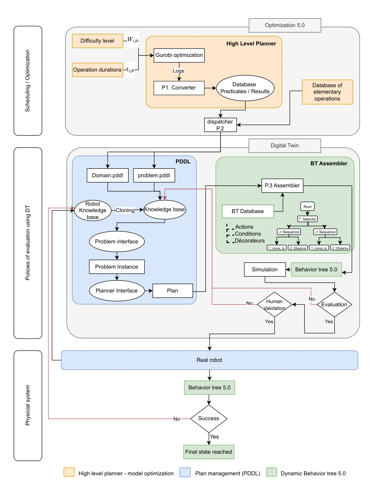
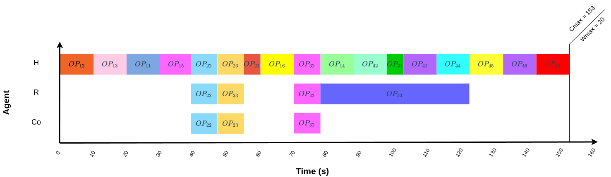
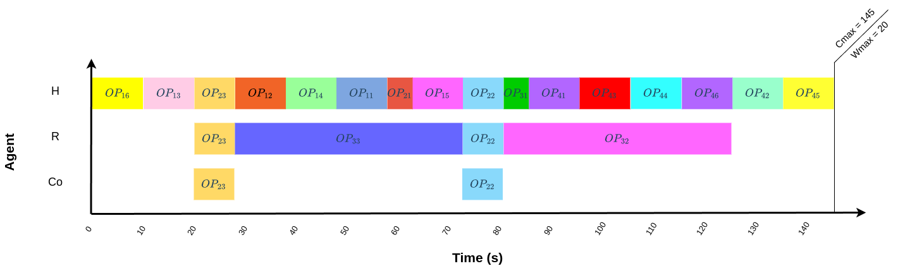

# Dynamic-Behavior-Tree

# Pipeline for Human-Robot Collaboration in Industry 5.0

This repository presents an innovative pipeline for planning and controlling collaborative tasks between humans and robots in an industrial setting. This work is based on the thesis **"Multi-objective Optimization of Human-Robot Collaboration Based on Artificial Intelligence: Application to the Aerospace Industry"**, defended by Pierre Hémono.

## Table of Contents
- [Context](#context)
- [Objectives](#objectives)
- [Pipeline Architecture](#pipeline-architecture)
- [Technologies Used](#technologies-used)
- [Installation](#installation)
- [Usage Examples](#usage-examples)
- [References](#references)

---

## Context

Industry 5.0 places humans at the center of industrial processes while integrating advanced technologies for seamless collaboration with robots. This approach combines:
- **Scheduling based on multi-objective optimization**: Considering fatigue, ergonomics, and individual preferences.
- **Control based on Behavior Trees**: Ensuring responsiveness and adaptability during task execution.

---

## Objectives

1. Incorporate human factors into the planning and execution of tasks.
2. Optimize human-robot interactions to ensure an ergonomic and productive work environment.
3. Provide a robust pipeline combining:
   - **Macro scheduling** (task planning)
   - **Micro control** (task execution via Behavior Trees)

---

## Pipeline Architecture

The pipeline is composed of three main blocks, each enabling effective collaboration between humans and robots:

### 1. **Optimization 5.0**
   - Handles high-level scheduling and multi-objective optimization using Gurobi.
   - **Modules**:
     - **P1. Converter**: Processes optimization logs (`solution.sol`) and translates them into a usable format for generating the PDDL knowledge base.
     - **P2. Dispatcher**: Combines translated logs with a database of elementary operations to produce `domain.pddl` and `problem.pddl` files, which are essential for high-level planning.

### 2. **Digital Twin**
   - Simulates and evaluates plans generated by the PDDL planner within a virtual environment.
   - **Module**:
     - **P3. Assembler**: Converts PDDL plans into executable Behavior Trees (BT). These BTs are tested through simulation for success or failure.
   - **Process**:
     - If the simulation succeeds, the plan is validated with the human operator.
     - If the human approves, the plan is passed to the real robot for execution.
     - Otherwise, the knowledge base is updated, and a new plan is generated.

### 3. **Real Robot**
   - Executes validated plans on the physical robot.
   - **Features**:
     - Continuously updates the PDDL knowledge base during execution.
     - In case of failure or blockage, the knowledge base is cloned, and a new plan is generated using the Digital Twin.

---

### Additional Details
- The pseudo-codes for **P1 (Converter)**, **P2 (Dispatcher)**, and **P3 (Assembler)** are included in this repository as the following files:
  - [Pseudo-code for P1 (Converter)](Pseudo_code_P1.pdf)
  - [Pseudo-code for P2 (Dispatcher)](Pseudo_code_P2.pdf)
  - [Pseudo-code for P3 (Assembler)](Pseudo_code_P3.pdf)

---



---

## Technologies Used

### Programming Languages
- **Python**: Core scripts are written in Python, compatible with versions 2.7 and 3.8+.

### Planning
- **PDDL**: Planning Domain Definition Language, a standard for automated planning.
- **POPF3**: A forward-chaining partial-order planner for PDDL, used for temporal planning.  
  Repository: [https://github.com/popflogic/popftemp](https://github.com/popflogic/popftemp)  
  Paper: **Coles et al.**, "Hybrid Temporal Planning: Reaching Into the Middle Ground," IJCAI 2009.

### Control Frameworks
- **py-trees**: A Python library for constructing and running Behavior Trees, developed by Daniel Stonier.  
  Repository: [https://github.com/splintered-reality/py_trees](https://github.com/splintered-reality/py_trees)  
  Documentation: [https://py-trees.readthedocs.io](https://py-trees.readthedocs.io)

### Robotics Middleware
- **ROS** (Robot Operating System): Provides the middleware for robot control and interaction.  
  Version used: **ROS Melodic**  
  Website: [https://www.ros.org/](https://www.ros.org/)

- **ROSPlan**: A framework for robot planning in ROS, developed by the University of Edinburgh.  
  Repository: [https://github.com/KCL-Planning/ROSPlan](https://github.com/KCL-Planning/ROSPlan)  
  Paper: **Michael Cashmore et al.**, "ROSPlan: Planning in the Robot Operating System," ICAPS 2015.

### Motion Planning
- **MoveIt**: A motion planning framework for ROS, used for robot arm manipulation.  
  Website: [https://moveit.ros.org/](https://moveit.ros.org/)

### Optimization
- **Gurobi**: Used for solving multi-objective scheduling problems.  
  Website: [https://www.gurobi.com/](https://www.gurobi.com/)

---

## Installation

1. Clone the repository:
   ```bash
   git clone https://github.com/PierreHemono/Dynamic-Behavior-Tree.git
   cd Dynamic-Behavior-Tree

2. Install the dependencies:
   ```bash
   pip install -r requirements.txt

## Usage

This section provides detailed instructions on how to utilize the three main components of the pipeline: **Converter (P1)**, **Dispatcher (P2)**, and **Assembler (P3)**.

### 1. **Converter (P1)**

**Purpose:**  
Processes optimization logs (`solution.sol`) and translates them into a usable format for generating the PDDL knowledge base.

**Input:**  
- Optimization log file: `solution.sol`

**Output:**  
- Translated logs: `solution_readable.txt`

**Steps to Use:**

1. **Navigate to the Converter directory:**
    ```bash
    cd 'your repositery'
    ```

2. **Run the Converter script: (python3.7)**
    ```bash
    python P1_Convertisseur.py
    ```

### 1. **Dispatcher (P2)**

**Purpose:**  
Combines translated logs with a database of elementary operations to produce `domain.pddl` and `problem.pddl` files, which are essential for high-level planning.

**Input:**  
- Translated logs: `solution_readable.txt`
- Elementary operations database: `operations_elementaires.json`

**Output:**  
- PDDL domain file: `domain.pddl`
- PDDL problem file: `problem.pddl`

**Steps to Use:**

1. **Navigate to the Dispatcher directory:**
    ```bash
    cd 'your repositery'
    ```

2. **Run the Dispatcher script: (python3.7)**
    ```bash
    python P2_Dispatcher.py
    ```


### Assembler (P3)

Purpose:  
Converts PDDL plans into executable Behavior Trees (BT). These BTs are tested through simulation for success or failure.

Input:  
- PDDL domain file: `domain.pddl`
- PDDL problem file: `problem.pddl`

Output:  
- Behavior Tree Python file: `behavior_tree_autoV2.py`

Steps to Use:

1. **Navigate to the Assembler directory:**
    ```bash
    cd 'your repositery'
    ```

2. **Run the Dispatcher script: (python3.7)**
    ```bash
    python P3_Assembleur.py
    ```


### Alternative Plans

The project balances two main objectives: minimizing the difficulty of work and reducing the makespan. This section provides alternative plans generated with different values of the alpha parameter. The alpha parameter controls the trade-off between these two objectives in our blended function. For more details, refer to our article [Multi objective optimization of human–robot collaboration: A case study in aerospace assembly line, Computers and Operations Research](https://www.sciencedirect.com/science/article/abs/pii/S0305054824003460).

The corresponding documents are as follows:
- [Gantt with alpha = 0.6](AlternativeAlpha06.sol)
- [Gantt with alpha = 0.8](AlternativeAlpha08.sol)

---

#### Gantt Chart (Alpha = 0.6)


---

#### Gantt Chart (Alpha = 0.8)


---

By renaming these alternative `.sol` files to the correct input filenames and using them in the pipeline, you can test the generalization of our system.


## References

If you use this work, please consider citing the following research papers in your references:

---


### Article 1

**Multi-objective optimization of human–robot collaboration: A case study in aerospace assembly line**  
*Pierre Hémono, Ahmed Nait Chabane, M’hammed Sahnoun*  
**Journal:** Computers & Operations Research  
**Volume:** 174, **Pages:** 106874, **Year:** 2025  
**DOI:** [10.1016/j.cor.2024.106874](https://doi.org/10.1016/j.cor.2024.106874)  
**URL:** [Read on ScienceDirect](https://www.sciencedirect.com/science/article/pii/S0305054824003460)  


BibTeX:
```bibtex
@article{HEMONO2025106874,
  title = {Multi objective optimization of human–robot collaboration: A case study in aerospace assembly line},
  journal = {Computers & Operations Research},
  volume = {174},
  pages = {106874},
  year = {2025},
  issn = {0305-0548},
  doi = {https://doi.org/10.1016/j.cor.2024.106874},
  url = {https://www.sciencedirect.com/science/article/pii/S0305054824003460},
  author = {Pierre Hémono and Ahmed {Nait Chabane} and M’hammed Sahnoun}
}
```

### Article 2

**Leveraging Digital Twin and Dynamic Scheduling for Enhanced Human-Robot Collaboration**  
*Pierre Hémono, Ahmed Nait Chabane, M’hammed Sahnoun*  
Available at: SSRN  
**DOI:** [DOI: 10.2139/ssrn.5065955](https://dx.doi.org/10.2139/ssrn.5065955)  
**URL:** [Read on SSRN](https://ssrn.com/abstract=5065955)  

BibTeX:
```bibtex
@article{HEMONO2025digitaltwin,
  title = {Leveraging Digital Twin and Dynamic Scheduling for Enhanced Human-Robot Collaboration},
  author = {Pierre Hémono and Ahmed {Nait Chabane} and M’hammed Sahnoun},
  year = {2025},
  url = {https://ssrn.com/abstract=5065955},
  doi = {10.2139/ssrn.5065955},
}
```