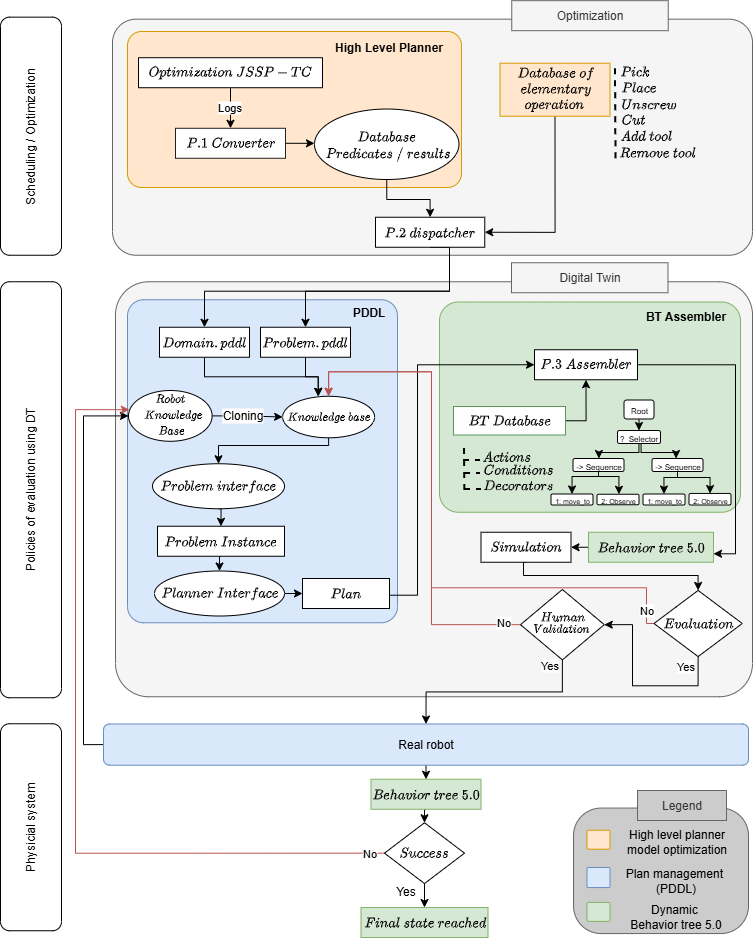

# Dynamic-Behavior-Tree

# Pipeline for Cognitive agent in Dynamic Workshop

This repository presents an innovative pipeline for planning and controlling collaborative tasks between several robots in dynamic industrial setting. This work is based on the thesis **"Multi-objective Optimization of Human-Robot Collaboration Based on Artificial Intelligence: Application to the Aerospace Industry"**, defended by Pierre Hémono.
This branch adapts the original ROSPlan-based pipeline to **ROS2 Humble** by integrating **PlanSys2** as the PDDL planning engine.  
The core Behavior Tree pipeline (Dispatcher, Assembler) is maintained, with updates for PlanSys2 compatibility.

## Table of Contents
- [Context](#context)
- [Objectives](#objectives)
- [Pipeline Architecture](#pipeline-architecture)
- [Technologies Used](#technologies-used)
- [Installation](#installation)
- [Usage Examples](#usage-examples)
- [Acknowledgements](#acknowledgements)
- [References](#references)

---

## Context

This branch is developed in the framework of the **RHINOCEROS European Project**, focused on the **recycling and dismantling of electric vehicle batteries**.

The goal is to design **cognitive agents** that meet the **resilience requirements of Industry 5.0**, while promoting **sustainability** through improved dismantling and recycling efficiency.  
The pipeline integrates both **high-level planning** and **low-level execution** to support this objective.

- **High level**: Task scheduling and optimization to improve the dismantling process and reduce overall makespan.
- **Low level**: Plan execution using **PDDL planning** (PlanSys2) and **Behavior Trees** for robust, reactive control.

This branch migrates the original ROSPlan-based pipeline to **ROS2 Humble** using **PlanSys2** as the PDDL planning engine, while preserving the modular structure (Dispatcher, Assembler, Digital Twin, Real Robot).

---

## Objectives

## Objectives
1. Ensure ROS2 compatibility (Humble Hawksbill).
2. Replace ROSPlan with PlanSys2 while preserving the existing Dispatcher + Assembler logic.
3. Enable dynamic problem updates through Problem Expert API and fallback strategies.
4. Provide a robust pipeline combining:
   - **Macro scheduling** (task planning)
   - **Micro control** (task execution via Behavior Trees)

---

## Pipeline Architecture

The pipeline is composed of three main blocks, each enabling effective collaboration between humans and robots:

### 1. **High Level Scheduling**
   - Handles high-level scheduling and optimization of dismantling operations.
   - **Modules**:
     - **P1. Converter**: Processes optimization logs (`solution.sol`) and translates them into a usable format for generating the PDDL knowledge base.
     - **P2. Dispatcher**: Generates the `domain.pddl` adapted to the dismantling use case and produces a Python initialization script for the Problem Expert API (replacing the `problem.pddl` file).

### 2. **Digital Twin**
   - Simulates and evaluates plans generated by PlanSys2 within a virtual environment.
   - **Modules**:
     - **P3. Assembler**: Converts plans from PlanSys2 into executable Behavior Trees (BT). These BTs are tested through simulation for success or failure.
   - **Process**:
     - If the simulation succeeds, the plan is validated.
     - If approved, the plan is passed to the real robot for execution.
     - Otherwise, the Problem Expert is updated, and a new plan is generated.

### 3. **Real Robot**
   - Executes validated plans on the physical robot.
   - **Features**:
     - Continuously updates the Problem Expert during execution through BT decorators.
     - In case of failure or blockage:
       - The updated Python initialization script (reflecting the latest problem state) is relaunched to restore the state.
       - A new plan is generated in PlanSys2.
       - A new BT is assembled and executed.


---

### 4. Differences with Main Branch & PlanSys2 alone
While this branch uses PlanSys2 as the planning engine instead of ROSPlan, the pipeline preserves key features from the main branch to ensure robustness and resilience.

---

### 5. Persistence and Recovery
PlanSys2 by itself does not:
- Journalize execution status (no log of actions executed by default)
- Save partial plan state
- Resume execution mid-plan after a crash

The pipeline addresses these limitations:
- **Execution logging**: The BT logs executed actions and their outcomes.
- **State persistence**: A Python “Problem Initialization” script replaces the `problem.pddl` file and is updated in real-time by the BT decorators to reflect the current state.
- **Crash recovery**: After a crash, relaunching this script restores the last known state into the Problem Expert, then a new plan is computed and a new BT is assembled.

This ensures the pipeline can resume operation without restarting the entire process from scratch.


---

### Additional Details
- The pseudo-codes for **P1 (Converter)**, **P2 (Dispatcher)**, and **P3 (Assembler)** are included in this repository as the following files:
  - [Pseudo-code for P1 (Converter)](Pseudo_code_P1.pdf)
  - [Pseudo-code for P2 (Dispatcher)](Pseudo_code_P2.pdf)
  - [Pseudo-code for P3 (Assembler)](Pseudo_code_P3.pdf)

---



---

## Technologies Used

### Programming Languages
- **Python**: Core scripts are written in Python, compatible with versions 3.8+.

### Planning
- **PDDL**: Planning Domain Definition Language, a standard for automated planning.
- **POPF3**: A forward-chaining partial-order planner for PDDL, used for temporal planning.  
  Repository: (historical repository unavailable) — alternatives: [https://github.com/fmrico/popf](https://github.com/fmrico/popf) (POPF) / [https://github.com/mortacious/popf2](https://github.com/mortacious/popf2) (POPF2)  
  Paper: **Coles et al.**, "Forward-Chaining Partial-Order Planning," [https://doi.org/10.1609/icaps.v20i1.13403].
- **PlanSys2**: Planning System for ROS2, replacing ROSPlan for problem management and plan generation.  
  Repository: [https://github.com/IntelligentRoboticsLabs/ros2_planning_system](https://github.com/IntelligentRoboticsLabs/ros2_planning_system)  
  Paper: **Francisco Martín et al.**, "PlanSys2: A Planning System for ROS2"

### Control Frameworks
- **py-trees**: A Python library for constructing and running Behavior Trees, developed by Daniel Stonier.  
  Repository: [https://github.com/splintered-reality/py_trees](https://github.com/splintered-reality/py_trees)  
  Documentation: [https://py-trees.readthedocs.io](https://py-trees.readthedocs.io)

### Robotics Middleware
- **ROS2 Humble**: Provides the middleware for robot control and interaction.  
  Website: [https://docs.ros.org/en/humble](https://docs.ros.org/en/humble)

### Motion Planning
- **MoveIt 2** (optional / future integration): A motion planning framework for ROS2, used for robot arm manipulation.  
  Website: [https://moveit.ros.org/](https://moveit.ros.org/)  
  *Note*: Motion planning is not integrated in the first phase of this branch; the focus is on generating valid plans.

### Optimization
- **Reinforcement Learning (Q-learning for JSSP with tool change)**:  
  Optimization is performed using an RL-based approach developed by project collaborators for job shop scheduling with tool changes.  
  Repository: [https://github.com/reshma-maharjan/job-shop-simulator/tree/tool_change_env](https://github.com/reshma-maharjan/job-shop-simulator/tree/tool_change_env)

---

## Installation

1. Clone the repository (Humble branch)
    ```bash
   git clone -b Humble https://github.com/PierreHemono/Dynamic-Behavior-Tree.git
   cd Dynamic-Behavior-Tree

2. Install ROS2 Humble
Follow the official installation guide for ROS2 Humble:
https://docs.ros.org/en/humble/Installation.html

3. Install PlanSys2
   ```bash
   sudo apt update
   sudo apt install ros-humble-plansys2-*

4. Install Python dependencies:
   ```bash
   pip install -r requirements.txt

5. Build the workspace
From your ROS2 workspace root (e.g., plansys2_ws):
   ```bash
   colcon build --symlink-install
   source install/setup.bash

## References

If you use this work, please consider citing the following research papers in your references:

---

### Article 1

**Leveraging Digital Twin and Dynamic Scheduling for Enhanced Human-Robot Collaboration**  
*Pierre Hémono, Ahmed Nait Chabane, M’hammed Sahnoun*  
Available at: SSRN  
**DOI:** [DOI: 10.2139/ssrn.5065955](https://dx.doi.org/10.2139/ssrn.5065955)  
**URL:** [Read on SSRN](https://ssrn.com/abstract=5065955)  

BibTeX:
```bibtex
@article{HEMONO2025digitaltwin,
  title = {Leveraging Digital Twin and Dynamic Scheduling for Enhanced Human-Robot Collaboration},
  author = {Pierre Hémono and Ahmed {Nait Chabane} and M’hammed Sahnoun},
  year = {2025},
  url = {https://ssrn.com/abstract=5065955},
  doi = {10.2139/ssrn.5065955},
}
```